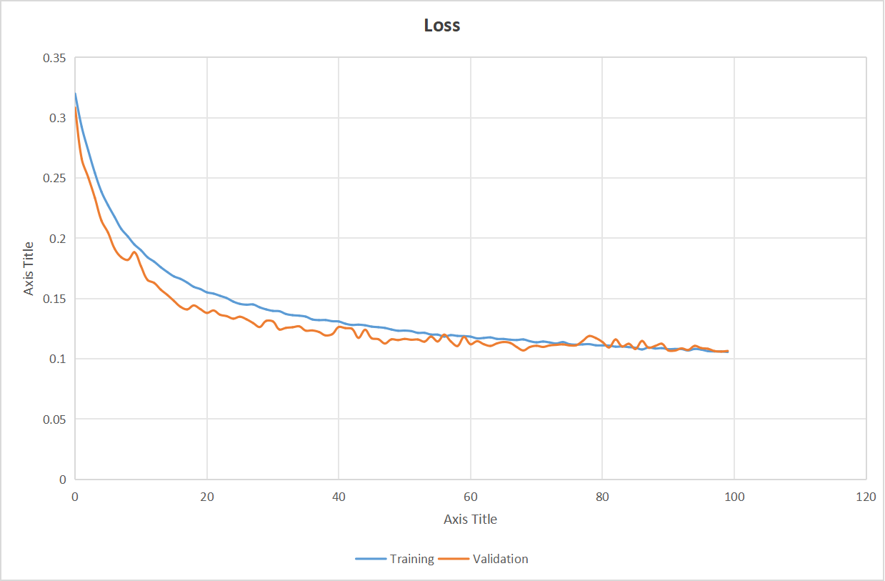
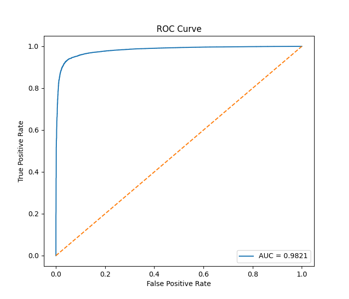
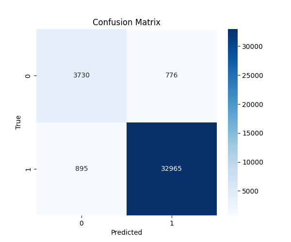

# ICU Risk Prediction using Temporal Deep Learning

## Overview

This project focuses on ICU patient risk prediction using Temporal Deep Learning on multivariate physiological time-series data from ICU patients.

The system processes patient vital signs, laboratory measurements, and neurological indicators over time to predict whether a patient is entering a clinically risky state.

The project uses a Temporal Convolutional Network (TCN) with an Attention Mechanism implemented in PyTorch.

---

# Final Results

| Metric | Score |
|---|---|
| Train Accuracy | 93.66% |
| Validation Accuracy | 94.39% |
| ROC-AUC Score | 0.9821 |
| Sequence Length | 32 |
| Clinical Features | 18 |
| Total Temporal Sequences | 255,770 |

---

# Model Architecture

The project uses:

- Temporal Convolutional Network (TCN)
- Dilated causal convolutions
- Residual temporal blocks
- Attention mechanism
- Temporal sequence modeling
- Multivariate physiological learning

The model captures:
- temporal dependencies
- physiological deterioration trends
- ICU instability patterns

---

# Clinical Features Used

The model uses 18 clinical signals:

| Category | Features |
|---|---|
| Vital Signs | HR, RespRate, Temp |
| Blood Pressure | NISysABP, NIDiasABP, NIMAP |
| Neurological | GCS |
| Renal | Urine |
| Kidney Function | BUN, Creatinine |
| Metabolic | Glucose, HCO3 |
| Hematology | HCT, Platelets, WBC |
| Electrolytes | K, Na, Mg |

---

# Dataset

This project uses ICU physiological data from:

- set-a
- set-b

Both datasets are combined into a large temporal learning dataset.

## Dataset Statistics

| Item | Value |
|---|---|
| Total Temporal Sequences | 255,770 |
| Sequence Length | 32 |
| Features per Timestep | 18 |

---

# Project Structure

```text
icu-risk-prediction/
│
├── assets/
│   └── 2026-05-26_07-59-27/
│
├── checkpoints/
│
├── data/
│   └── raw/
│       ├── set-a/
│       └── set-b/
│
├── evaluation/
│
├── final_model/
│
├── logs/
│
├── notebooks/
│
├── src/
│   ├── preprocess.py
│   ├── dataset.py
│   ├── tcn_model.py
│   ├── train.py
│   ├── evaluate.py
│   ├── inference.py
│   └── utils.py
│
├── requirements.txt
├── README.md
└── .gitignore
```

---

# Training Pipeline

## Preprocessing

The preprocessing pipeline includes:

- temporal sequence generation
- missing value handling
- forward filling
- backward filling
- clinical default value imputation
- feature normalization
- temporal sliding window generation

---

# Deep Learning Pipeline

The training pipeline includes:

- PyTorch implementation
- GPU acceleration support
- TensorBoard logging
- checkpoint saving
- validation monitoring
- temporal batch learning

---

# TensorBoard Monitoring

The project includes full TensorBoard integration for:

- train loss
- validation loss
- train accuracy
- validation accuracy

Run TensorBoard:

```bash
tensorboard --logdir=logs
```

Then open:

```text
http://localhost:6006
```

---

# Evaluation Metrics

The evaluation pipeline includes:

- Accuracy
- Precision
- Recall
- F1-score
- ROC Curve
- ROC-AUC
- Confusion Matrix

---

# Training Curves

## Loss Curves



---

# ROC Curve



---

# Confusion Matrix



---

# Installation

## Clone Repository

```bash
git clone https://github.com/Sriharsh007-Techie/icu-risk-prediction.git

cd icu-risk-prediction
```

---

## Create Virtual Environment

```bash
python -m venv venv
```

Activate environment:

### Windows

```bash
venv\Scripts\activate
```

### Linux / MacOS

```bash
source venv/bin/activate
```

---

## Install Dependencies

```bash
pip install -r requirements.txt
```

---

# Training

Run:

```bash
cd src

python train.py
```

---

# Evaluation

Run:

```bash
cd src

python evaluate.py
```

---

# Current Status

## Stable Version 1 Frozen

This version includes:

- Temporal Deep Learning
- Attention-based TCN
- Large-scale ICU temporal modeling
- TensorBoard experiment tracking
- Full evaluation pipeline
- ROC analysis
- Confusion matrix analysis

---

# Future Improvements

Planned future improvements:

- weighted loss functions
- threshold tuning
- explainability (SHAP)
- attention visualization
- Streamlit dashboard
- Transformer-based architectures
- real-time ICU inference

---

# Research References

1. Bai, Shaojie, J. Zico Kolter, and Vladlen Koltun.  
   "An Empirical Evaluation of Generic Convolutional and Recurrent Networks for Sequence Modeling."  
   arXiv preprint arXiv:1803.01271 (2018).

2. Vaswani, Ashish, et al.  
   "Attention Is All You Need."  
   Advances in Neural Information Processing Systems (NeurIPS), 2017.

3. Johnson, Alistair E. W., et al.  
   "MIMIC-III, a freely accessible critical care database."  
   Scientific Data 3, no. 1 (2016): 160035.

4. Lea, Colin, et al.  
   "Temporal Convolutional Networks for Action Segmentation and Detection."  
   IEEE Conference on Computer Vision and Pattern Recognition (CVPR), 2017.

5. Hochreiter, Sepp, and Jürgen Schmidhuber.  
   "Long Short-Term Memory."  
   Neural Computation 9.8 (1997): 1735–1780.

---

# Technologies Used

- Python
- PyTorch
- NumPy
- Pandas
- Scikit-learn
- Matplotlib
- Seaborn
- TensorBoard

---

# Author

Sriharsh Kulkarni

RWTH Aachen University  
M.Sc. Robotics Systems Engineering